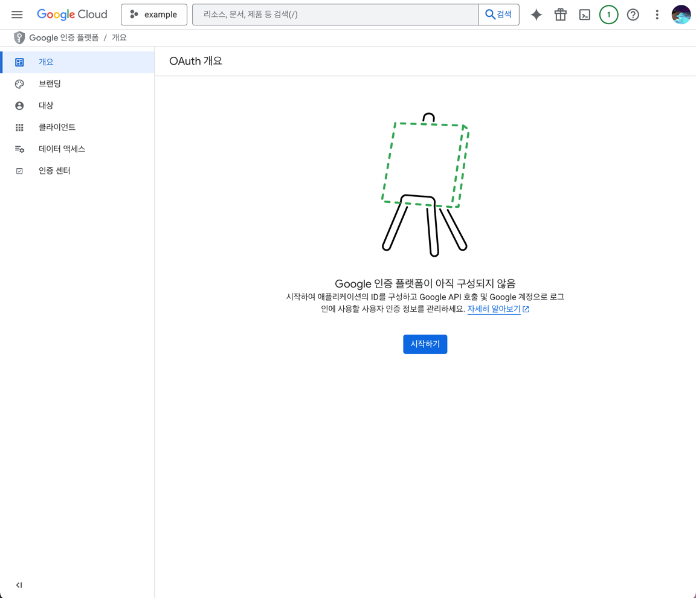
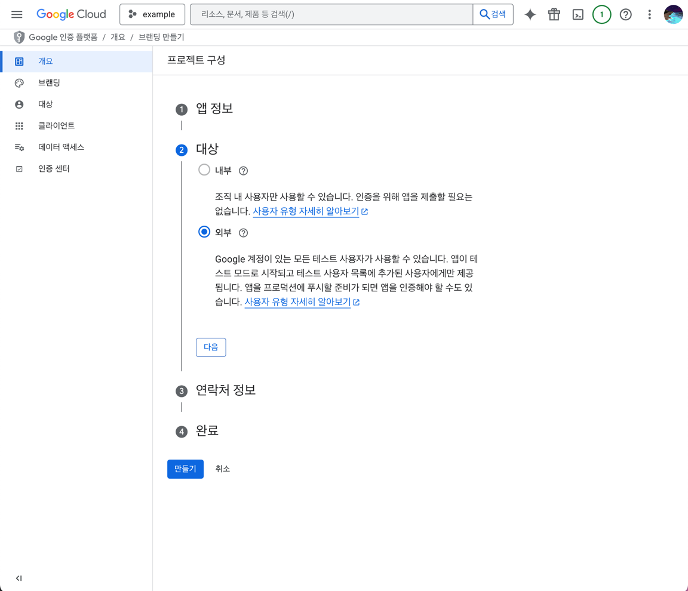
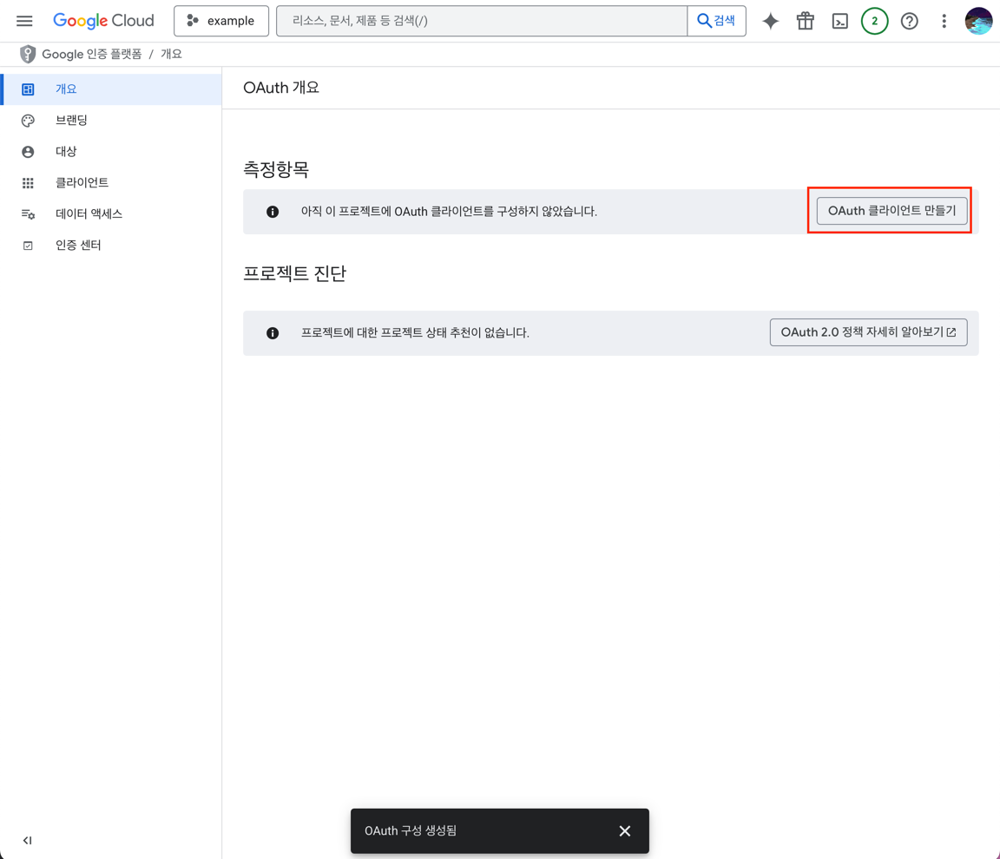
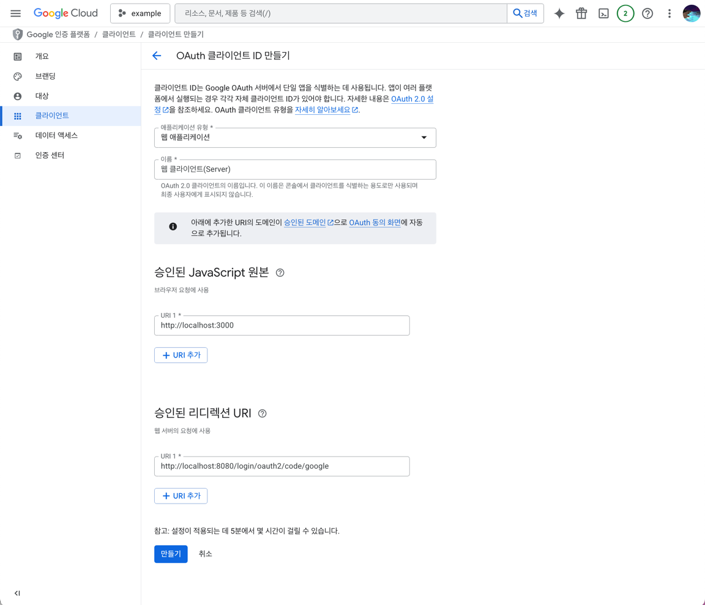
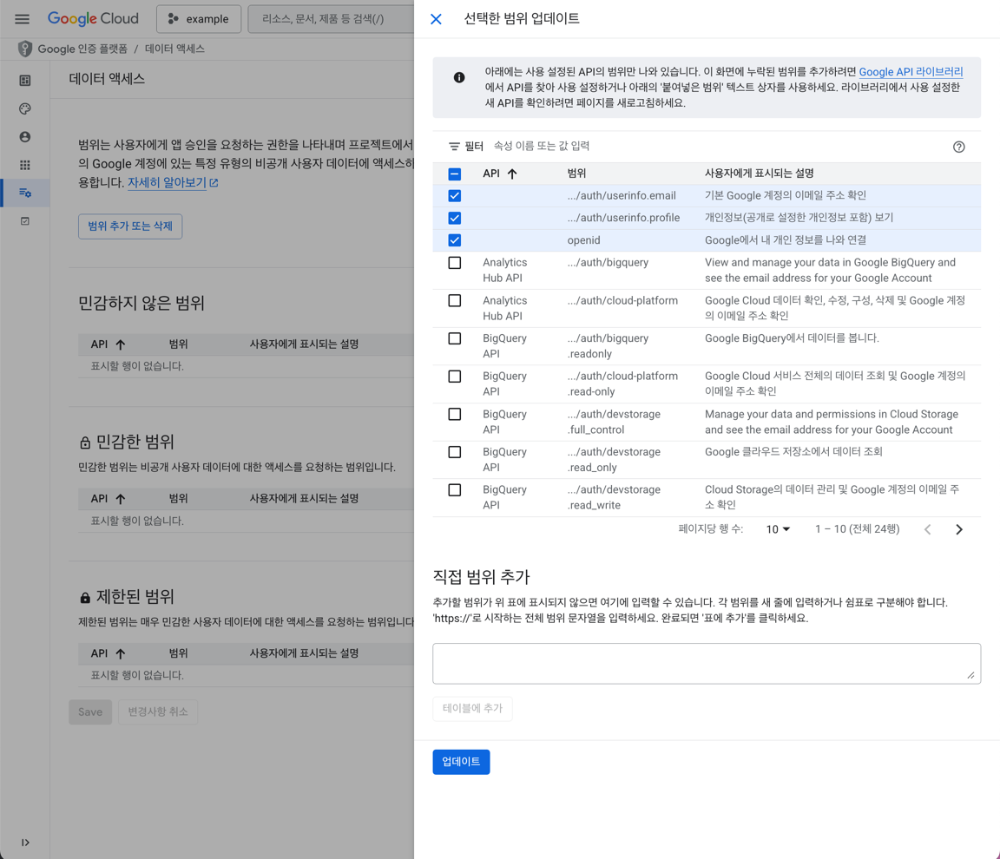
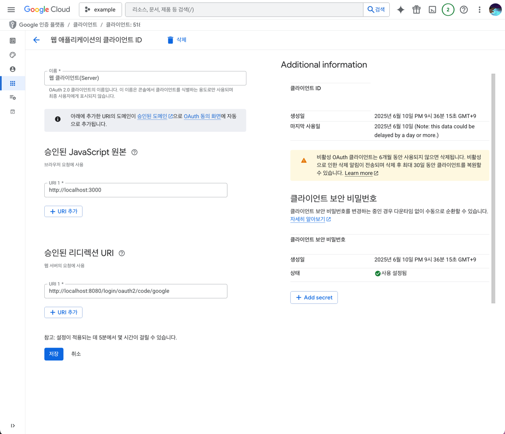

### 1. [GCP(Google Cloud Platform)](https://cloud.google.com)의 콘솔 접속 후 [프로젝트 선택] - [새 프로젝트 추가]

### 2. 인증 플랫폼 구성

#### [API 및 서비스] > [OAuth 동의 화면] > [시작하기]

### 3. Google 인증 플랫폼 프로젝트 구성

### 4. OAuth클라이언트 만들기

### 5. 동의 항목 설정

#### 제공할 데이터 선택

### 6. 클라이언트 ID와 클라이언트 보안 비밀번호를 이용하여 개발 시작

