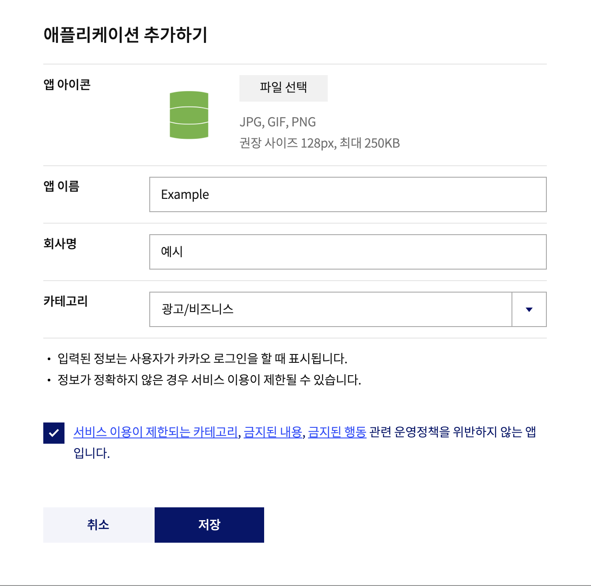
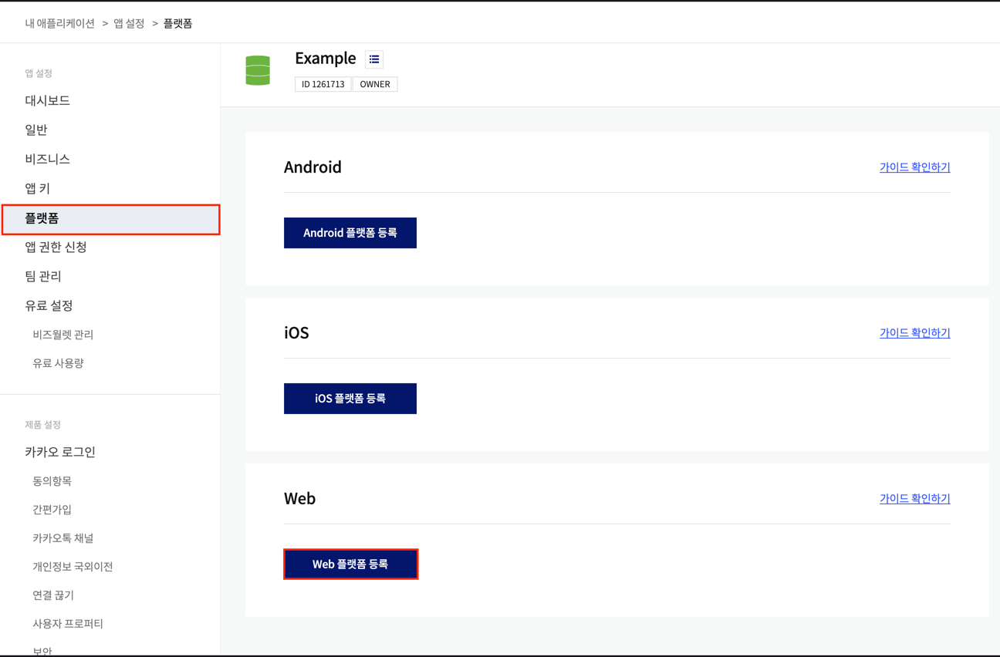
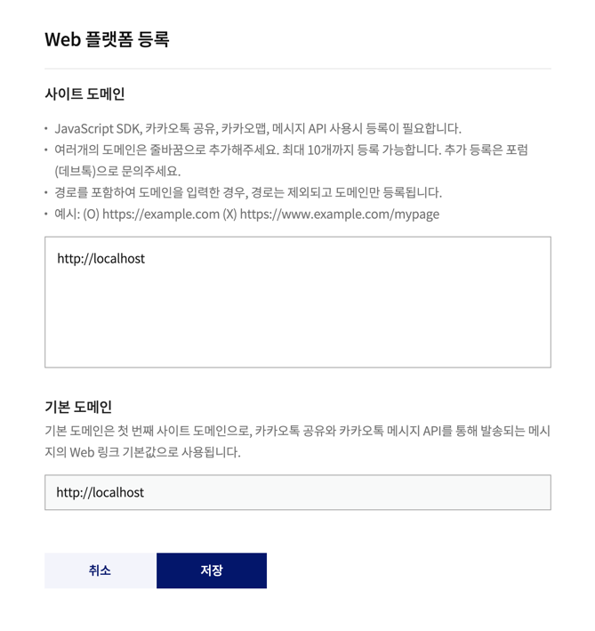
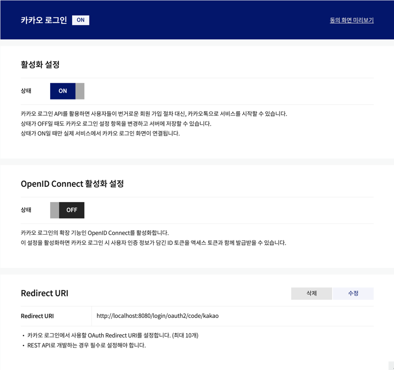
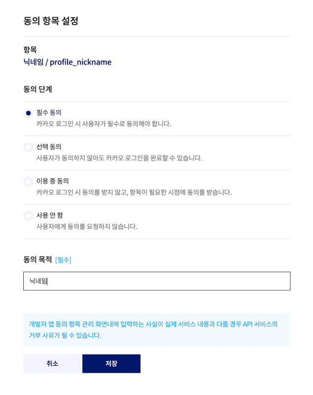
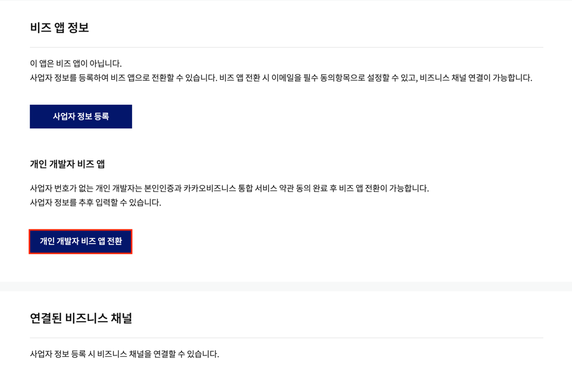

### 1. [Kakao developers](https://developers.kakao.com/)의 내 앱에 접속한 후 애플리케이션 추가하기 버튼 클릭

### 2. 애플리케이션 정보 입력

### 3. 플랫폼 등록

#### [앱설정] > [플랫폼] > [Web 플랫폼 등록] 선택

#### 로컬에서만 사용할 예정이기 때문에 사이트 도메인은 `http://localhost`로 등록해준다.

### 4. 카카오 로그인 활성화 및 Redirect URI 등록

#### [제품 설정] > [카카오 로그인] 에서 활성화 상태 ON으로 변경 및 Redirect URI등록

### 5. 동의 항목 설정

#### [제품 설정] > [카카오 로그인] > [동의항목]에서 필요한 정보 동의항목 설정

### 6. (선택) 비즈앱 전환

#### 카카오계정(이메일)이 필요하다면 [개인정보 동의항목 심사 신청]을 통해 비즈앱 전환

### 7. 앱키 확인

#### [앱 키]에 있는 REST API 키가 바로 `client-id`이다. 이 ID를 이용하여 개발 시작

